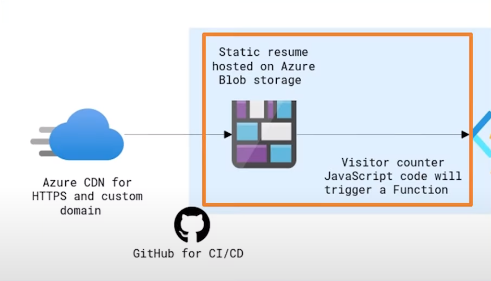
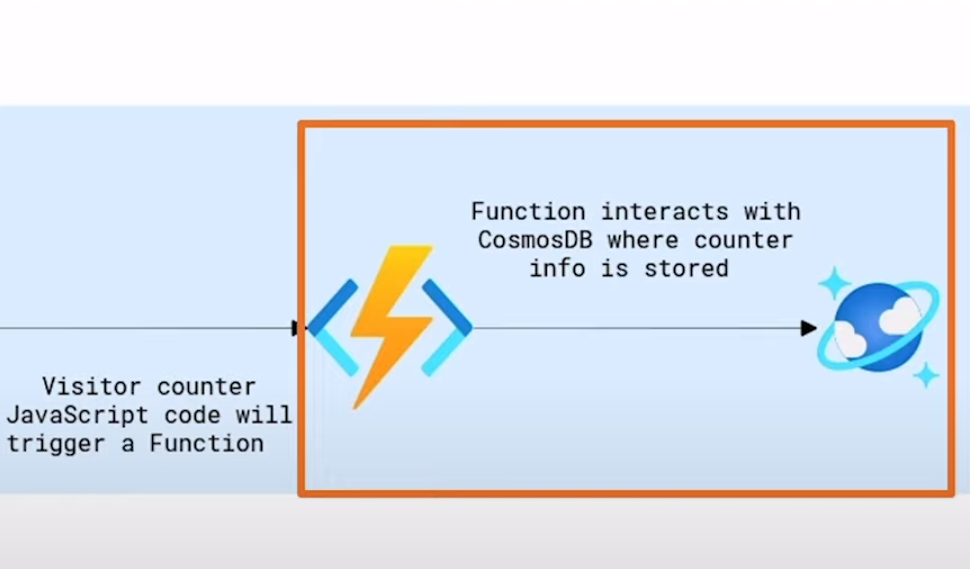

# azure-resume
My own azure resume, following 
[ACG project video](https://www.youtube.com/watch?v=ieYrBWmkfno), [Git and GitHub for Beginners - Crash Course youtube videos](https://www.youtube.com/watch?v=RGOj5yH7evk), [Git: branches in Visual Studio Code](https://www.youtube.com/watch?v=b9LTz6joMf8).

## Pre-requisites
```
Azure Account  
.Net Core 3.1 SDK if not available use `.NET Core 6`  
Azure Functions Core Tools 
Azure storage extension   
Visual Studio Code  
Azure CLI  
C# Extension  
Github Account  
Custom domain from any DNS provider
```
## **First section: Build the frontend**  


**1.** **Set up our version control** 
###### *Created a GitHub Repository, cloned the starter code and tried my best to understand the project structure before tackling this first step.* 
**2.** **Update the HTML and implement `counter`**  
###### *This is where I updated the HTML with my resume info and wrote the JavaScript code for the visitor counter.*
**3.** **Test locally and push changes to GitHub**  
###### *Viewed the website locally before pushing all the changes to GitHub.*


#### First step

- Frontend folder contains website. 
- main.js contains visitor counter code.


## **Second section: Build the backend**  



**1.** **Set up our Cosmos DB resources** 
###### *Create a Cosmos DB account, database, and container, and data.* 
**2.** **Set up an Azure Function**  
###### *Create an Azure Function to interact with the Cosmos DB counter data.*
**3.** **Test locally** 
###### *At this point, test our Function locally to make sure the counter data can be viewed in a browser and in the website locally.*

## **Third section: Deploying to Azure**  

**1.** **Deploy Azure Function**
###### *Deploy Azure Function to Azure, by grabbing the URL and updating the JavaScript code with that same URL. * 
**2.** **Deploy to Blob Container**  
###### *Deploy static site to a blob container.*
**3.** **Setup Azure CDN** 
###### *Setup Azure CDN for HTTPS and custom domain support.*  

- Azure CDN is a global cloud-based **content delivery network** (CDN) that helps accelerate the delivery of your web and mobile applications to end users.  
If you don't already have a custom domain I recommend using [namecheap](https://www.namecheap.com/domains/registration/gtld/one/).

**`CACHING AND PURGING`**  
1. **Caching** - is the process of storing copies of files in a cache, or temporary storage location, so that they can be accessing more quickly.
1. **Purging** - is the process of removing cached content before the predetermined expiry date.
1. **Purge as part of the CI/CD** - I will incorporate a purge in the pipeline since it is good practice to ensure visitors get most up to date assets.

## **Forth section: Building the CI/CD pipeline**  


**1.** **Create the frontend workflow.**  

###### *Create the  GitHub workflow responsible for deploying the frontend of the project.*  

**2.** **Implement unit testing**  
###### *Create unit tests to test the Azure Functions code as part of the deployment workflow.*

**3.** **Create backend workflow** 
###### *Create the GitHub workflow responsible for deploying the backend of the project.*
